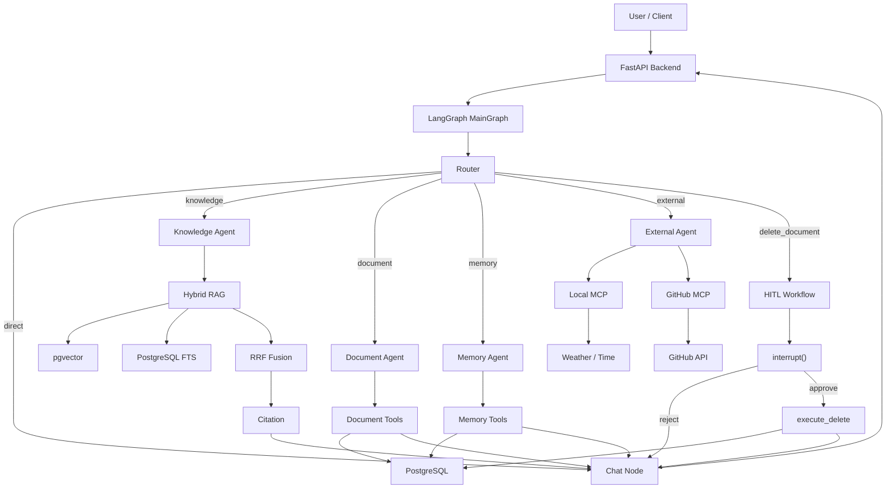
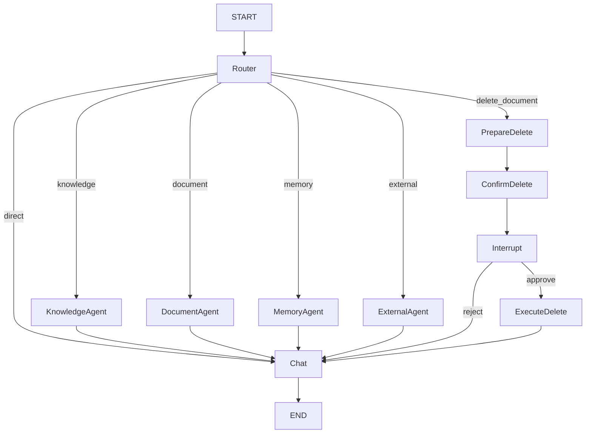
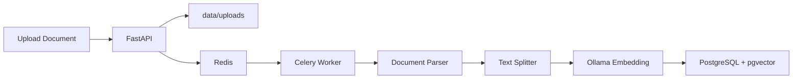
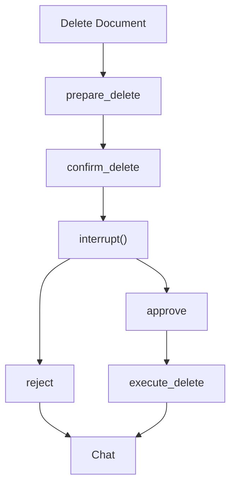
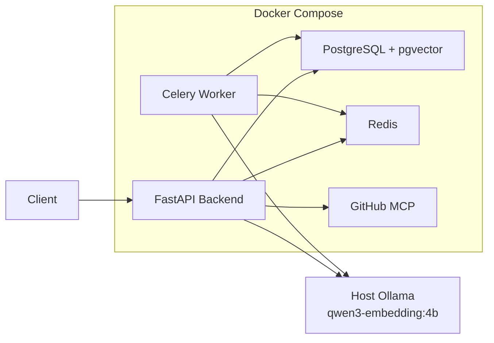

# NodAgent

> 基于 LangGraph 的多 Agent 知识库系统
> A Multi-Agent Knowledge Base System powered by LangGraph, Hybrid RAG, MCP and Human-in-the-Loop.


**NodAgent** 是一个面向个人与团队知识管理场景的 AI 应用后端，基于 **FastAPI + LangGraph + PostgreSQL/pgvector + Redis/Celery + MCP + Docker Compose** 构建。

项目重点不是简单封装一次 LLM API，而是围绕真实 AI 应用中的几个核心问题进行设计：

* 如何使用 LangGraph 编排多个 Specialist Agent？
* 如何将向量检索与关键词检索组合成 Hybrid RAG？
* 如何为回答提供可追溯的 Citation？
* 如何保存跨会话的长期记忆？
* 如何通过 MCP 接入外部工具系统？
* 如何让删除等高风险操作经过 Human-in-the-Loop？
* 如何异步处理文档解析、切块和 Embedding？
* 如何通过 SSE 向前端实时推送 Agent 执行结果？
* 如何将整套 AI 后端以多服务方式容器化运行？

---

## ✨ Highlights

### 🧩 Multi-Agent Orchestration

基于 **LangGraph StateGraph** 手写主流程，由 Router 根据用户意图选择不同处理路径，并由 Specialist Agent 负责具体领域任务。

当前包含：

* **Knowledge Agent**：Hybrid RAG、知识库检索、Citation
* **Document Agent**：文档列表、详情和处理状态查询
* **Memory Agent**：用户 / Workspace 长期记忆管理
* **External Agent**：天气、时间以及 GitHub MCP 工具调用
* **HITL Workflow**：高风险操作执行前 `interrupt()`，用户确认后 `resume`

### 🔎 Hybrid RAG

同时使用：

* pgvector Semantic Search
* PostgreSQL Full Text Search
* Reciprocal Rank Fusion（RRF）
* Citation Context

相比单一路径向量检索，可以同时利用语义相似度与关键词匹配结果。

### 🧠 Persistent Memory

同时实现：

* LangGraph Checkpointer：保存 Graph / Thread / Interrupt 状态
* Long-term Memory：保存用户与 Workspace 的长期信息
* 跨 Thread Memory Retrieval

### 🔌 MCP Integration

支持两类 MCP Transport：

* FastMCP Local Server + stdio
* GitHub Official MCP Server + Streamable HTTP

当前 External Agent 可以访问：

* 当前天气
* 当前时间
* GitHub Repository
* GitHub Issue
* GitHub Pull Request

### ⚡ Async Document Pipeline

通过 **Redis + Celery** 将文档解析、切块和 Embedding 从 HTTP 请求中解耦，避免文档处理阻塞 FastAPI。

### 🐳 Docker Compose

使用 Docker Compose 管理：

* FastAPI Backend
* Celery Worker
* PostgreSQL + pgvector
* Redis
* GitHub MCP Server

Ollama 保留运行在宿主机，由 Backend / Worker 通过 `host.docker.internal` 调用。

---

# 🏗 Architecture



---

# 🧩 LangGraph Design

NodAgent 中将 **Graph Node、Agent、Tool、Service** 分成不同层。

例如知识库查询：

```text
knowledge_node
      ↓
Knowledge Agent
      ↓
search_knowledge_base Tool
      ↓
RAG Service
      ↓
PostgreSQL / pgvector
```

其中：

* **Node**：负责 LangGraph 流程编排
* **Agent**：负责特定领域的推理与 Tool 选择
* **Tool**：Agent 可以调用的业务能力
* **Service**：具体的数据访问、检索和业务实现

这种方式避免将所有逻辑集中在一个 Agent 中。

---

## MainGraph



---

# 🔎 Hybrid RAG

NodAgent 没有只使用 Vector Search。

完整检索流程：

```text
User Query
    │
    ├───────────────┐
    │               │
    ▼               ▼
Embedding      Keyword Query
    │               │
    ▼               ▼
pgvector      PostgreSQL FTS
    │               │
    └───────┬───────┘
            ▼
        RRF Fusion
            │
            ▼
        Top-K Chunks
            │
            ▼
      Citation Context
            │
            ▼
       Knowledge Agent
            │
            ▼
         Chat Node
```

## Vector Retrieval

Embedding Model：

```text
qwen3-embedding:4b
```

Embedding Dimension：

```text
1024
```

Embedding 由宿主机 **Ollama** 提供。

向量数据存储在 PostgreSQL `document_chunks` 中，并使用 pgvector HNSW 索引进行相似度检索。

---

## Keyword Retrieval

使用 PostgreSQL Full Text Search：

```text
to_tsvector(...)
```

并通过 GIN Index 加速关键词检索。

---

## RRF Fusion

Vector Search 与 Keyword Search 得到两组排序结果后，通过 **Reciprocal Rank Fusion** 进行融合。

```text
Vector Results
      +
Keyword Results
      ↓
     RRF
      ↓
Final Ranking
```

这样既保留语义检索能力，也能利用明确关键词匹配。

---

# 📎 Citation

知识库回答会将真实检索结果转换为 Citation。

例如：

```text
用户：

Docker integration test 文档中使用了哪些技术？

NodAgent：

文档中提到了 FastAPI、Redis、Celery、
Ollama Embeddings、PostgreSQL 和 pgvector。[1]
```

接口同时返回 Source：

```json
{
  "source_number": 1,
  "citation": "[1]",
  "document_id": 11,
  "chunk_id": 18,
  "filename": "nodagent_docker_pipeline_test.pdf",
  "page_number": 1,
  "similarity": 0.713
}
```

Citation 可以继续用于前端：

* 展示来源文件
* 跳转原始文档
* 展示命中 Chunk
* 展示页码
* 进行回答溯源

---

# 📄 Asynchronous Document Pipeline

文档上传后不会在 HTTP 请求中同步完成全部处理。



文档状态：

```text
uploaded
   ↓
queued
   ↓
processing
   ↓
completed
```

异常情况下：

```text
failed
```

并记录 `processing_error`。

目前已经实际验证 PDF / TXT 文档处理链路。

---

# 🧠 Long-Term Memory

普通 Chat History 和 Long-term Memory 在 NodAgent 中是两个不同概念。

## User Memory

保存与用户相关的长期偏好。

例如：

```text
coding_preference
=
代码修改时提供完整文件，不只提供局部 Patch。
```

## Workspace Memory

保存 Workspace 级稳定信息。

例如：

```text
project_type
=
基于 LangGraph 的多 Agent 知识库系统
```

Memory 数据持久化到：

```text
agent_memories
```

每次 Agent 执行前加载到 Runtime Context。

因此：

```text
Thread A
   ↓
保存长期记忆
   ↓
PostgreSQL

Thread B
   ↓
加载长期记忆
   ↓
Agent 仍然可以获取相关信息
```

实现跨 Thread 的长期上下文。

---

# 💾 LangGraph Persistence

NodAgent 使用：

```text
AsyncPostgresSaver
```

保存 LangGraph 运行状态。

主要用于：

* Thread State
* Graph State
* Interrupt State
* Resume State

需要注意：

```text
chat_threads / chat_messages
```

属于业务聊天数据。

而：

```text
LangGraph checkpoint tables
```

属于 Graph Workflow 状态。

两者职责不同。

---

# 🧑‍💻 Human-in-the-Loop

对于删除文档等有副作用的操作，Agent 不会直接执行。



核心原则：

> Side Effect 只发生在用户明确批准之后。

在 `interrupt()` 前：

```text
Document Record     保留
Document Chunks     保留
Physical File       保留
```

用户：

```text
reject
```

则取消操作。

用户：

```text
approve
```

通过：

```text
Command(resume=...)
```

恢复原 Graph 并执行真正删除。

---

# 🔌 MCP

## Local MCP

使用 FastMCP 构建本地 MCP Server：

```text
External Agent
      ↓
MCP Adapter
      ↓
stdio
      ↓
External Info MCP
      ├── get_weather
      └── get_current_time
```

支持：

* 实时天气
* 当前时间

---

## GitHub MCP

同时接入 GitHub Official MCP Server。

```text
External Agent
      ↓
MCP Adapter
      ↓
Streamable HTTP
      ↓
GitHub MCP Container
      ↓
GitHub API
```

当前开放：

* Repository
* Repository Files
* Issue
* Pull Request

GitHub MCP 使用 **Read-Only Mode**。

因此 Agent 不允许：

* Push Code
* Merge Pull Request
* 修改 Repository
* 修改 Issue
* 修改 Pull Request

---

# 🌊 SSE Streaming

提供 SSE Streaming API。

普通 Chat：

```text
start
  ↓
token
  ↓
token
  ↓
done
```

RAG：

```text
start
  ↓
sources
  ↓
token
  ↓
done
```

HITL：

```text
start
  ↓
interrupt
```

用户确认：

```text
resume
  ↓
token
  ↓
done
```

这样前端可以实时展示：

* LLM Token
* Citation Sources
* Agent 状态
* HITL Confirmation
* Resume Result

---

# 🐳 Docker Architecture

NodAgent 使用 Docker Compose 管理主要应用服务。



Docker Compose 当前管理：

```text
backend
worker
postgres
redis
github-mcp
```

Ollama 保留运行在宿主机。

---

## Docker Network

Container 之间通过 Docker Compose 内部 DNS 通信：

```text
backend
→ postgres:5432

backend
→ redis:6379

backend
→ github-mcp:8082

worker
→ postgres:5432

worker
→ redis:6379
```

Ollama 位于宿主机：

```text
backend / worker
        ↓
host.docker.internal:11434
        ↓
Ollama
```

---

## Shared Upload Storage

Backend 与 Worker 需要访问相同的上传文件：

```text
Host
./data/uploads
       │
       ├───────────────┐
       ▼               ▼
    Backend          Worker
/app/data/uploads /app/data/uploads
```

Backend 保存文件后，Celery Worker 可以读取相同路径继续进行文档处理。

---

## PostgreSQL Persistence

PostgreSQL 使用 Named Volume：

```text
nodagent_postgres_data
```

普通执行：

```bash
docker compose down
```

不会删除 PostgreSQL 数据。

> ⚠️ `docker compose down -v` 会同时删除 Volume，请谨慎使用。

---

# 🛠 Tech Stack

| Layer            | Technology                          |
| ---------------- | ----------------------------------- |
| Language         | Python 3.11                         |
| API              | FastAPI                             |
| Agent            | LangChain / LangGraph               |
| LLM              | DeepSeek                            |
| Embedding        | Ollama / qwen3-embedding:4b         |
| Vector Database  | PostgreSQL + pgvector               |
| Keyword Search   | PostgreSQL Full Text Search         |
| Hybrid Retrieval | Vector Search + FTS + RRF           |
| Async Task       | Redis + Celery                      |
| Memory           | PostgreSQL + LangGraph Checkpointer |
| External Tools   | MCP / FastMCP / GitHub MCP          |
| Streaming        | SSE                                 |
| Container        | Docker / Docker Compose             |

---

# 📁 Project Structure

```text
NodAgent/
│
├── backend/
│   └── app/
│       │
│       ├── agents/
│       │   ├── knowledge_agent.py
│       │   ├── document_agent.py
│       │   ├── memory_agent.py
│       │   └── external_agent.py
│       │
│       ├── graphs/
│       │   └── main_graph.py
│       │
│       ├── tools/
│       │   ├── knowledge_tools.py
│       │   ├── document_tools.py
│       │   └── memory_tools.py
│       │
│       ├── services/
│       │   ├── agent_service.py
│       │   ├── rag_service.py
│       │   ├── embedding_service.py
│       │   ├── citation_service.py
│       │   ├── memory_service.py
│       │   └── mcp_service.py
│       │
│       ├── mcp_servers/
│       │   └── external_info_server.py
│       │
│       ├── tasks/
│       │   └── document_tasks.py
│       │
│       ├── api/
│       ├── models/
│       ├── schemas/
│       ├── core/
│       ├── db/
│       │
│       ├── celery_app.py
│       └── main.py
│
├── data/
│   └── uploads/
│
├── Dockerfile
├── docker-compose.yml
├── requirements.txt
├── .env.example
├── .dockerignore
└── README.md
```

---

# 🚀 Quick Start

## 1. Clone Repository

```bash
git clone https://github.com/21breeze/NodAgent.git

cd NodAgent
```

---

## 2. Configure Environment

复制环境变量模板：

```bash
cp .env.example .env
```

然后编辑 `.env`。

主要配置：

```env
# PostgreSQL
POSTGRES_USER=nodagent
POSTGRES_PASSWORD=your_password
POSTGRES_DB=nodagent
POSTGRES_HOST=localhost
POSTGRES_PORT=15432

# Redis
REDIS_URL=redis://localhost:16379/0
CELERY_BROKER_URL=redis://localhost:16379/0
CELERY_RESULT_BACKEND=redis://localhost:16379/1

# DeepSeek
DEEPSEEK_API_KEY=your_deepseek_api_key
DEEPSEEK_MODEL=deepseek-flash

# Ollama
OLLAMA_BASE_URL=http://localhost:11434
EMBEDDING_MODEL_NAME=qwen3-embedding:4b
EMBEDDING_DIMENSION=1024

# GitHub MCP
GITHUB_PERSONAL_ACCESS_TOKEN=your_githu
```
