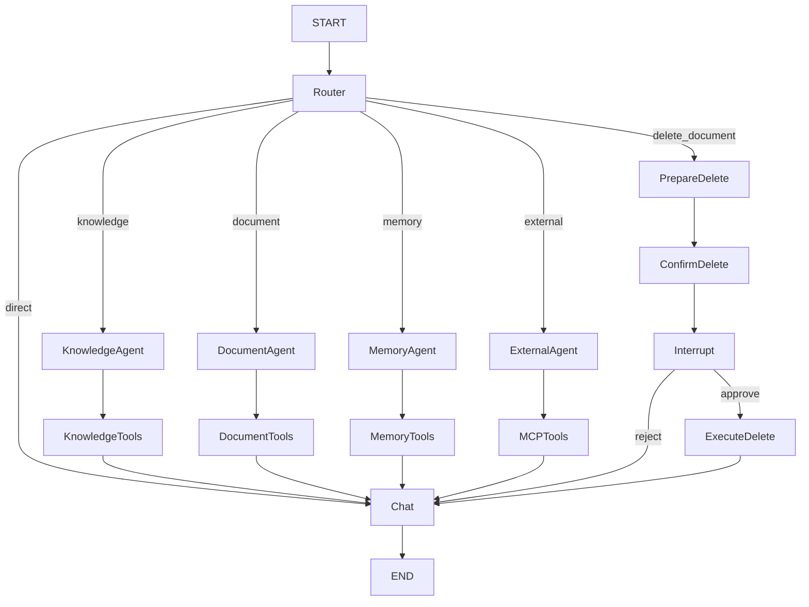
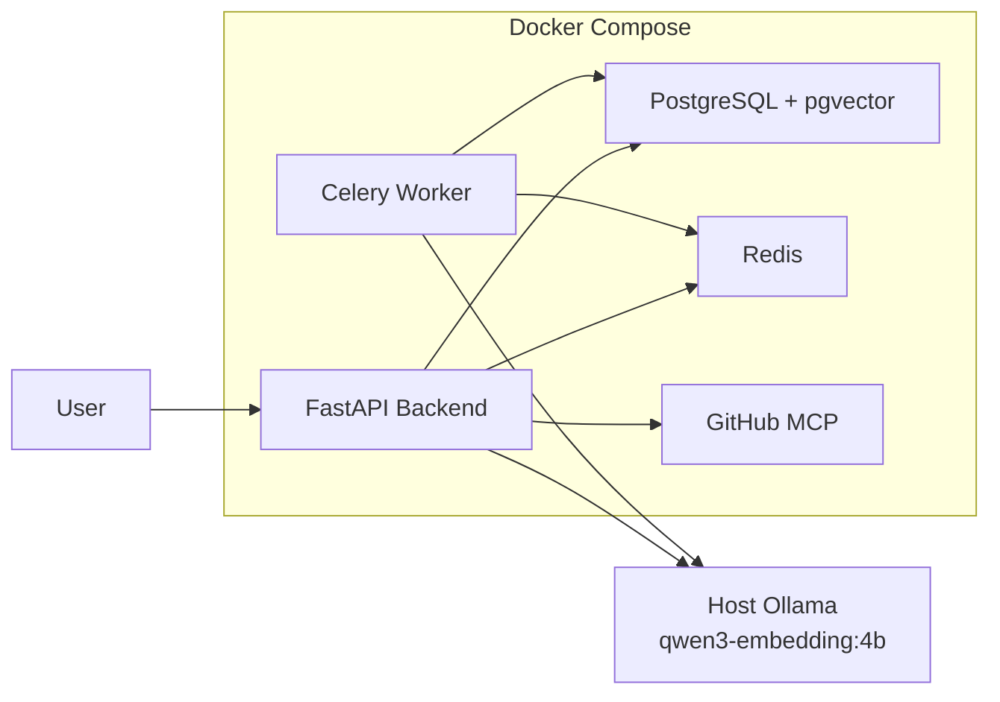

# NodAgent

> 基于 LangGraph 的多 Agent 知识库系统

NodAgent 是一个面向个人与团队知识管理场景的 AI Agent 系统，基于 **FastAPI + LangGraph + PostgreSQL/pgvector + Redis/Celery + MCP + Docker Compose** 构建。

项目围绕真实 AI 应用中的 **知识库检索、多 Agent 协作、长期记忆、外部工具调用、Human-in-the-Loop 和流式交互** 等能力进行设计，而不是单纯封装一次大模型 API 调用。

系统通过手写 LangGraph 主图完成任务路由，由不同 Specialist Agent 分别负责知识检索、文档管理、长期记忆和外部工具调用；知识库采用 pgvector 向量检索与 PostgreSQL 全文检索结合，并通过 RRF 进行结果融合。

---

## ✨ Features

### Multi-Agent Orchestration

基于 LangGraph 手写主流程 `StateGraph`，由 Router 根据用户意图选择不同处理路径。

当前包含：

* **Knowledge Agent**

  * 知识库检索
  * Hybrid RAG
  * Citation 引用

* **Document Agent**

  * 文档列表
  * 文档信息查询
  * 文档状态查询

* **Memory Agent**

  * 用户长期记忆
  * Workspace 长期记忆
  * Memory 查询、保存与删除

* **External Agent**

  * 天气查询
  * 当前时间查询
  * GitHub Repository / Issue / Pull Request 查询
  * MCP Tool 调用

* **Human-in-the-Loop**

  * 高风险操作执行前暂停
  * 用户 approve / reject
  * 基于 LangGraph Checkpointer 恢复执行

---

## 🧠 Hybrid RAG

NodAgent 的知识库检索不是单一向量搜索，而是同时使用：

```text
User Query
    │
    ├── Vector Search
    │     └── PostgreSQL + pgvector
    │
    └── Keyword Search
          └── PostgreSQL Full Text Search
                  │
                  ▼
             RRF Fusion
                  │
                  ▼
            Top-K Chunks
                  │
                  ▼
              Citation
                  │
                  ▼
              LLM Answer
```

### 检索流程

1. 使用 Ollama Embedding Model 对 Query 生成向量
2. pgvector 进行语义向量检索
3. PostgreSQL FTS 进行关键词检索
4. 使用 Reciprocal Rank Fusion（RRF）融合两路结果
5. 构建 Citation Context
6. LLM 根据真实检索结果生成最终答案

当前使用：

```text
Embedding Model:
qwen3-embedding:4b

Embedding Dimension:
1024
```

Citation 返回的信息包括：

```text
source_number
document_id
chunk_id
filename
page_number
content
similarity
vector_rank
keyword_rank
rrf_score
```

示例：

```text
用户：
Docker integration test 文档中使用了哪些技术？

NodAgent：

文档中提到了 FastAPI、Redis、Celery、
Ollama Embedding、PostgreSQL 和 pgvector。[1]
```

同时接口会返回对应 Source：

```json
{
  "source_number": 1,
  "citation": "[1]",
  "document_id": 11,
  "chunk_id": 18,
  "filename": "nodagent_docker_pipeline_test.pdf",
  "page_number": 1
}
```

---

## 📄 Asynchronous Document Pipeline

文档上传后不会阻塞 HTTP 请求，而是通过 Redis + Celery 执行异步处理。

```text
Upload Document
      │
      ▼
FastAPI
      │
      ├── Save File
      │
      └── Create Document Record
              │
              ▼
            Redis
              │
              ▼
        Celery Worker
              │
              ├── Parse Document
              │
              ├── Split Chunks
              │
              ├── Generate Embeddings
              │
              ▼
       PostgreSQL + pgvector
```

文档状态：

```text
uploaded
   ↓
queued
   ↓
processing
   ↓
completed
```

异常情况下：

```text
failed
```

并记录具体错误信息。

---

## 🧩 LangGraph Architecture

主图由 `StateGraph` 手工编排，而不是使用黑盒式 Agent 框架完成全部流程。



### Node、Agent、Tool 的职责划分

NodAgent 中三者并不是同一个概念。

例如：

```text
knowledge_node
      │
      ▼
Knowledge Agent
      │
      ▼
search_knowledge_base Tool
      │
      ▼
RAG Service
      │
      ▼
PostgreSQL / pgvector
```

* **Node**

  * LangGraph 中的流程节点

* **Agent**

  * 负责特定领域任务的智能体

* **Tool**

  * Agent 真正执行操作的能力

这种设计将：

```text
流程控制
Agent 推理
业务能力
基础设施
```

进行分层，降低系统耦合。

---

## 🧠 Long-Term Memory

除了普通对话历史，NodAgent 还实现了独立的长期记忆系统。

支持两种 Memory Scope：

### User Memory

用于保存用户长期偏好，例如：

```text
代码修改时提供完整文件，
不要只提供局部 Patch。
```

### Workspace Memory

用于保存项目级稳定信息，例如：

```text
project_type
=
基于 LangGraph 的多 Agent 知识库系统
```

长期记忆保存在 PostgreSQL：

```text
agent_memories
```

并在每次 Agent 执行前加载到 Runtime Context。

因此即使创建一个新的 Thread：

```text
New Thread
    │
    ▼
Load Agent Memory
    │
    ▼
Build Runtime Context
    │
    ▼
MainGraph
```

Agent 仍然可以获取之前保存的长期信息。

---

## 🔌 MCP Integration

项目通过 MCP 接入外部工具能力。

目前包含两类 MCP Transport。

### Local MCP Server

基于 FastMCP 实现：

```text
External Agent
      │
      ▼
MCP Adapter
      │
      ▼
stdio
      │
      ▼
External Info MCP
      │
      ├── get_weather
      └── get_current_time
```

支持：

* 当前天气
* 当前时间

### GitHub MCP

接入 GitHub 官方 MCP Server，并使用 Streamable HTTP：

```text
External Agent
      │
      ▼
MCP Adapter
      │
      ▼
Streamable HTTP
      │
      ▼
GitHub MCP Server
      │
      ▼
GitHub API
```

当前开放只读能力：

```text
Repositories
Issues
Pull Requests
```

GitHub MCP 使用 Read-Only 模式，避免 Agent 执行：

* Push
* Merge
* Repository 修改
* Issue 修改
* Pull Request 修改

---

## 🧑‍💻 Human-in-the-Loop

对于文档删除等具有副作用的操作，NodAgent 不允许 Agent 直接执行。

流程：

```text
用户请求删除文档
       │
       ▼
prepare_delete
       │
       ▼
confirm_delete
       │
       ▼
interrupt()
       │
       ├───────────────┐
       │               │
    reject          approve
       │               │
       ▼               ▼
     Chat       Command(resume)
                       │
                       ▼
                execute_delete
```

关键原则：

> 副作用只允许发生在用户明确 approve 之后。

在 `interrupt()` 之前：

```text
Document Record    保留
Document Chunks    保留
Physical File      保留
```

用户批准后才真正执行删除。

---

## 💾 Persistence

系统使用两套不同的持久化机制。

### Business Data

PostgreSQL 保存：

```text
workspaces
documents
document_chunks
chat_threads
chat_messages
agent_memories
```

### LangGraph State

LangGraph 使用：

```text
AsyncPostgresSaver
```

保存：

* Graph State
* Thread State
* Interrupt State
* Resume State

业务聊天记录和 LangGraph Checkpoint 相互独立。

---

## 🌊 SSE Streaming

NodAgent 支持 Server-Sent Events 流式响应。

普通对话事件：

```text
start
  ↓
token
  ↓
token
  ↓
done
```

RAG 场景：

```text
start
  ↓
sources
  ↓
token
  ↓
done
```

HITL：

```text
start
  ↓
interrupt
```

用户确认后：

```text
resume
  ↓
token
  ↓
done
```

因此前端可以实时展示：

* 模型生成内容
* RAG Sources
* Agent 执行状态
* HITL 用户确认状态

---

# 🐳 Docker Architecture

项目使用 Docker Compose 管理主要基础设施与应用服务。



Docker Compose 当前管理：

```text
postgres
redis
backend
worker
github-mcp
```

Ollama 保留运行在宿主机。

Container 通过：

```text
host.docker.internal:11434
```

访问 Ollama。

---

## Docker Network

Container 之间通过 Docker Compose 内部 DNS 通信：

```text
backend
→ postgres:5432

backend
→ redis:6379

backend
→ github-mcp:8082

worker
→ postgres:5432

worker
→ redis:6379
```

而不是使用：

```text
localhost
```

---

## Shared Upload Storage

Backend 与 Worker 需要访问同一份上传文件：

```text
./data/uploads
       │
       ├── Backend
       │    └── /app/data/uploads
       │
       └── Worker
            └── /app/data/uploads
```

因此文档上传后：

```text
Backend Save
    ↓
Celery Task
    ↓
Worker Read
```

能够访问同一个文件。

---

## PostgreSQL Persistence

PostgreSQL 使用 Docker Named Volume：

```text
nodagent_postgres_data
```

所以普通：

```bash
docker compose down
```

不会删除数据库数据。

> ⚠️ 不要随意使用 `docker compose down -v`，`-v` 会删除数据库 Volume。

---

# 🛠 Tech Stack

### Backend

* Python 3.11
* FastAPI
* SQLAlchemy
* Pydantic

### AI / Agent

* LangChain
* LangGraph
* DeepSeek
* Ollama
* MCP
* FastMCP

### RAG

* PostgreSQL
* pgvector
* PostgreSQL Full Text Search
* HNSW
* Reciprocal Rank Fusion

### Async Task

* Redis
* Celery

### Infrastructure

* Docker
* Docker Compose

---

# 📁 Project Structure

```text
NodAgent/
│
├── backend/
│   └── app/
│       │
│       ├── agents/
│       │   ├── knowledge_agent.py
│       │   ├── document_agent.py
│       │   ├── memory_agent.py
│       │   └── external_agent.py
│       │
│       ├── graphs/
│       │   └── main_graph.py
│       │
│       ├── tools/
│       │   ├── knowledge_tools.py
│       │   ├── document_tools.py
│       │   └── memory_tools.py
│       │
│       ├── services/
│       │   ├── rag_service.py
│       │   ├── embedding_service.py
│       │   ├── memory_service.py
│       │   ├── agent_service.py
│       │   ├── citation_service.py
│       │   └── mcp_service.py
│       │
│       ├── mcp_servers/
│       │   └── external_info_server.py
│       │
│       ├── tasks/
│       │   └── document_tasks.py
│       │
│       ├── models/
│       ├── schemas/
│       ├── api/
│       ├── db/
│       ├── core/
│       │
│       ├── celery_app.py
│       └── main.py
│
├── data/
│   └── uploads/
│
├── Dockerfile
├── docker-compose.yml
├── requirements.txt
├── .env.example
└── README.md
```

---

# 🚀 Getting Started

## 1. Clone

```bash
git clone <your-repository-url>

cd NodAgent
```

---

## 2. Configure Environment

复制配置文件：

```bash
cp .env.example .env
```

配置：

```env
POSTGRES_USER=nodagent
POSTGRES_PASSWORD=your_password
POSTGRES_DB=nodagent

DEEPSEEK_API_KEY=your_deepseek_api_key
DEEPSEEK_MODEL=deepseek-flash

EMBEDDING_MODEL_NAME=qwen3-embedding:4b
EMBEDDING_DIMENSION=1024

GITHUB_PERSONAL_ACCESS_TOKEN=your_github_token
```

> 不要将真实 `.env` 提交到 Git。

---

## 3. Install Ollama

确保宿主机已经安装 Ollama。

下载 Embedding Model：

```bash
ollama pull qwen3-embedding:4b
```

确认：

```bash
ollama list
```

---

## 4. Start NodAgent

```bash
docker compose up -d --build
```

查看服务：

```bash
docker compose ps
```

正常情况下：

```text
nodagent-postgres
nodagent-redis
nodagent-backend
nodagent-worker
nodagent-github-mcp
```

均处于运行状态。

---

## 5. API Documentation

启动完成后访问：

```text
http://127.0.0.1:8000/docs
```

FastAPI Swagger UI 可以直接查看和测试全部 API。

---

# 📡 Core APIs

### Chat

```http
POST /api/workspaces/{workspace_id}/chat
```

### Streaming Chat

```http
POST /api/workspaces/{workspace_id}/chat/stream
```

### Resume HITL

```http
POST /api/workspaces/{workspace_id}/chat/resume
```

### Streaming Resume

```http
POST /api/workspaces/{workspace_id}/chat/stream/resume
```

### Upload Document

```http
POST /api/workspaces/{workspace_id}/documents
```

### Documents

```http
GET /api/workspaces/{workspace_id}/documents
```

### Document Status

```http
GET /api/workspaces/{workspace_id}/documents/{document_id}/status
```

### Document Chunks

```http
GET /api/workspaces/{workspace_id}/documents/{document_id}/chunks
```

---

# 🧪 Example

创建 Thread 后，可以向 Agent 提问：

```text
根据知识库总结这个项目使用了哪些技术。
```

Router：

```text
knowledge
```

然后：

```text
Knowledge Agent
      ↓
Hybrid Retrieval
      ↓
Citation
      ↓
Chat
```

普通问题：

```text
Python 装饰器是什么？
```

则直接：

```text
Router
↓
direct
↓
Chat
```

需要实时信息：

```text
东京现在天气怎么样？
```

流程：

```text
Router
↓
External Agent
↓
Weather MCP
```

GitHub：

```text
查看 langchain-ai/langgraph 当前有哪些 open issues。
```

流程：

```text
Router
↓
External Agent
↓
GitHub MCP
↓
GitHub API
```

---

# ✅ Verified Workflows

以下功能均已完成实际链路测试：

* [x] FastAPI API
* [x] PostgreSQL / pgvector
* [x] Redis
* [x] Celery asynchronous document processing
* [x] Ollama Embedding
* [x] PDF / TXT document ingestion
* [x] Vector Retrieval
* [x] PostgreSQL Full Text Search
* [x] RRF Hybrid Retrieval
* [x] Citation
* [x] LangGraph Main Graph
* [x] Multi-Agent routing
* [x] Long-term Memory
* [x] LangGraph Checkpointer
* [x] Human-in-the-Loop
* [x] Command Resume
* [x] SSE Streaming
* [x] Local MCP
* [x] GitHub MCP
* [x] Docker Compose

---

# 🔐 Security

项目遵循以下基本安全原则：

* `.env` 不进入 Git Repository
* Docker Image 不打包 `.env`
* GitHub Token 通过环境变量注入
* GitHub MCP 使用 Read-Only 模式
* 高风险删除操作使用 Human-in-the-Loop
* 用户上传文件不进入 Git Repository

---

# 🎯 Design Goals

NodAgent 重点关注的不只是“能调用大模型”，而是完整 AI Application Backend 中的几个核心问题：

```text
如何组织多个 Agent？

如何将 RAG 与 Agent 结合？

如何保存跨会话长期记忆？

如何让高风险 Tool 调用可控？

如何通过 MCP 扩展外部能力？

如何处理耗时文档任务？

如何实现实时流式交互？

如何让整套系统可部署？
```

项目通过 LangGraph、RAG、MCP、Celery、PostgreSQL 和 Docker 等组件，对这些问题进行了完整实现。

---

# 📌 Project Status

当前版本已完成核心后端架构及主要 Agent 能力。

后续可继续完善：

* Agent Trace / Observability
* 系统评估模块
* Authentication / RBAC
* Rate Limit
* Automated Test Suite
* CI/CD
* Web Management UI
* Production Deployment

---

# 📄 License

This project is intended for learning, research and engineering practice.

Please add an appropriate open-source license before public distribution.
